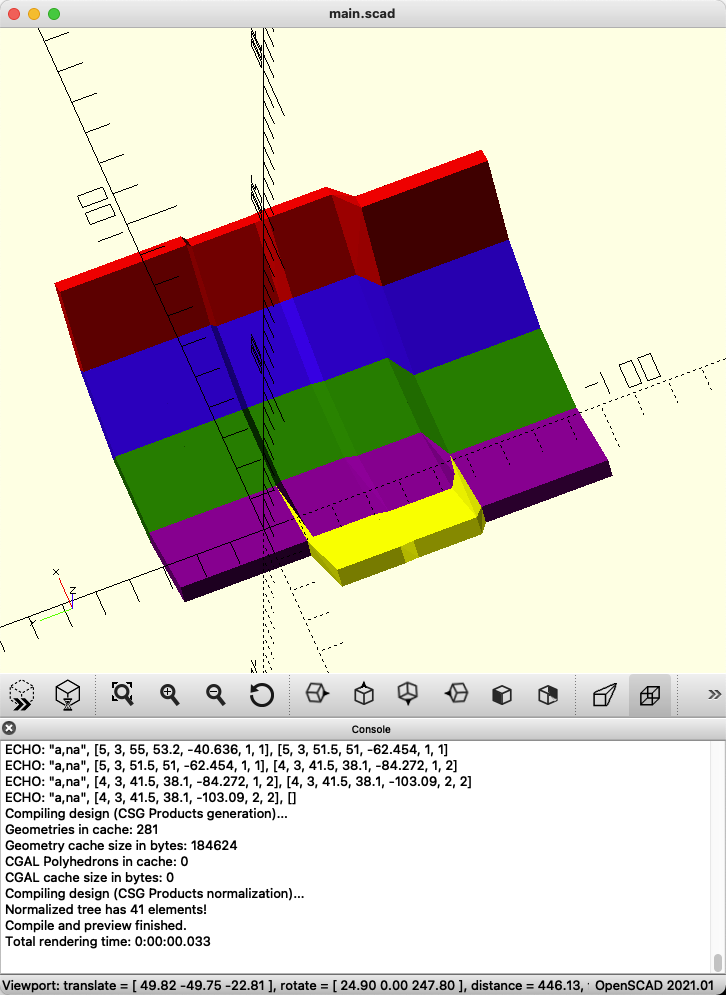

# Pterosphera V2

## Strategy
I'm having trouble choosing between OpenSCAD and Go for this.  OpenSCAD produces "crisper" models that are a lot smaller on disk, but is a weaker language.  The particular library I've picked in golang leverages a stronger language, but produces "mushy" models that are huge.

I'm pausing on my work on the Go strategy, and revisiting how I'm generating the curve of switches to see if I can get a solution there...

## Build Log

### Fri Mar 4

Finished working out the easier sides of the case (back and outer edge).  The next part is going to be a bit tougher,
as it's about time to start working out how the thumb clusters work, including with the trackball socket.

### Sat Feb 26

Taking a couple steps back to be able to take a bunch forward.  I'm pulling back to double-down on my strategy of building
all the vertices for the dish before rendering.  I'm using matrixes to simulate custom types, so that I can better calculate
the points for the edges for building the case around the model.  I'm pretty happy with where it's landed so far.

### Wed Feb 23

Last night I struggled a bit getting the traditional DM bevel on the top part of this.  I saw on Reddit a Dactyl-style board that had a bevel that inset the keys a bit.  Inspired by this, I've created a top bevel that may be easier to work with for the back of the case - especially when it comes time to generate the holes for the cables.

### Tue Feb 22

I've got the column generation down, including joining the columns together.  In order to do this, I had to use a combined strategy of generating the individual points and faces (and wrapping with `hull()`), to generate the objects.  This is because a simple polyhedron doesn't perform well when you try to use `difference()` on it.  With `hull()`, you only have to define two opposing faces - further simplifying it.

Now that I'm using this strategy of individual points, it will make rendering the MX holes into the plate much easier, and I have points to work off of for generating the body of the case!

## Printing Notes

### Trackball Socket
When printing stand-alone:

  * Print with the socket opening face-down - the sensor mount will be upward/on the top.  Use a brim, and use tree supports.

### Switch Sockets
These are designed for MX style switches, with:

  * Cutouts for opening the switch in-board, so we can solder in place, and take off the top part of the switch.  This likely won't be used, ever, but it doesn't hurt to have.
  * Notches in (under) the top plate so that the clips on the switches will grab the plate, making it so that they are more secure, and require a tool to remove.
  * Screw hole sockets (for heat-insert), for the Amoeba 1u PCB (Amoeba-royale v2.0 - https://github.com/JKing-B16/keyboard-pcbs/tree/master/amoeba-royale)

#### When printing stand-alone:

  * Print with the top-plate down on the glass bed, with a brim.  Use tree supports.
