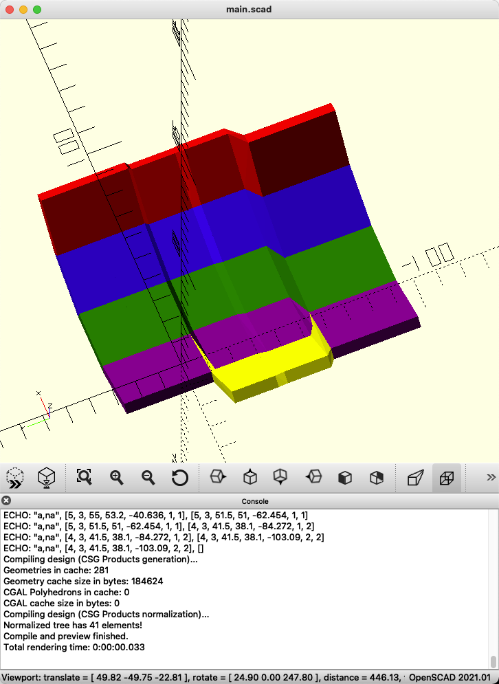

# Pterosphera V2

## Build Log
### Tue Feb 22

I've got the column generation down, including joining the columns together.  In order to do this, I had to use a combined strategy of generating the individual points and faces (and wrapping with `hull()`), to generate the objects.  This is because a simple polyhedron doesn't perform well when you try to use `difference()` on it.  With `hull()`, you only have to define two opposing faces - further simplifying it.

Now that I'm using this strategy of individual points, it will make rendering the MX holes into the plate much easier, and I have points to work off of for generating the body of the case!

## Trackball Socket

### Printing Notes
When printing stand-alone:

  * Print with the socket opening face-down - the sensor mount will be upward/on the top.  Use a brim, and use tree supports.

## Switch Sockets
These are designed for MX style switches, with:

  * Cutouts for opening the switch in-board, so we can solder in place, and take off the top part of the switch.  This likely won't be used, ever, but it doesn't hurt to have.
  * Notches in (under) the top plate so that the clips on the switches will grab the plate, making it so that they are more secure, and require a tool to remove.
  * Screw hole sockets (for heat-insert), for the Amoeba 1u PCB (Amoeba-royale v2.0 - https://github.com/JKing-B16/keyboard-pcbs/tree/master/amoeba-royale)

### Printing Notes
When printing stand-alone:

  * Print with the top-plate down on the glass bed, with a brim.  Use tree supports.

